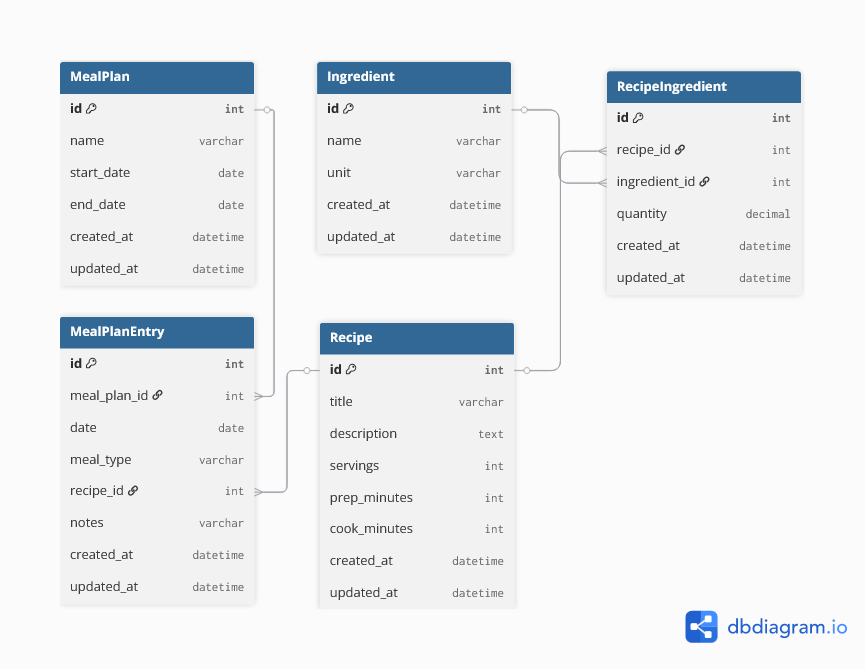

# MealPrepped

A Django app to help with weekly meal planning, shopping lists, food expiry reminders, and an inventory dashboard.  
The app also includes a small machine learning recommender to suggest "what to cook next," guiding user decision making in terms of cost and preferences.

### ER Diagram

### Models
- *Ingredient*: catalog of items (`name`, `unit`).
- *Recipe*: A dish (`title`, `servings`, `prep_minutes`, `cook_minutes`).
- *RecipeIngredient*: Linking a ingredients with a `quantity` to one or many recipes.
- *MealPlan*: Date range (e.g., a week).
- *MealPlanEntry*: Date slot in a plan (`date`, `meal_type`) that may reference a `Recipe`.
